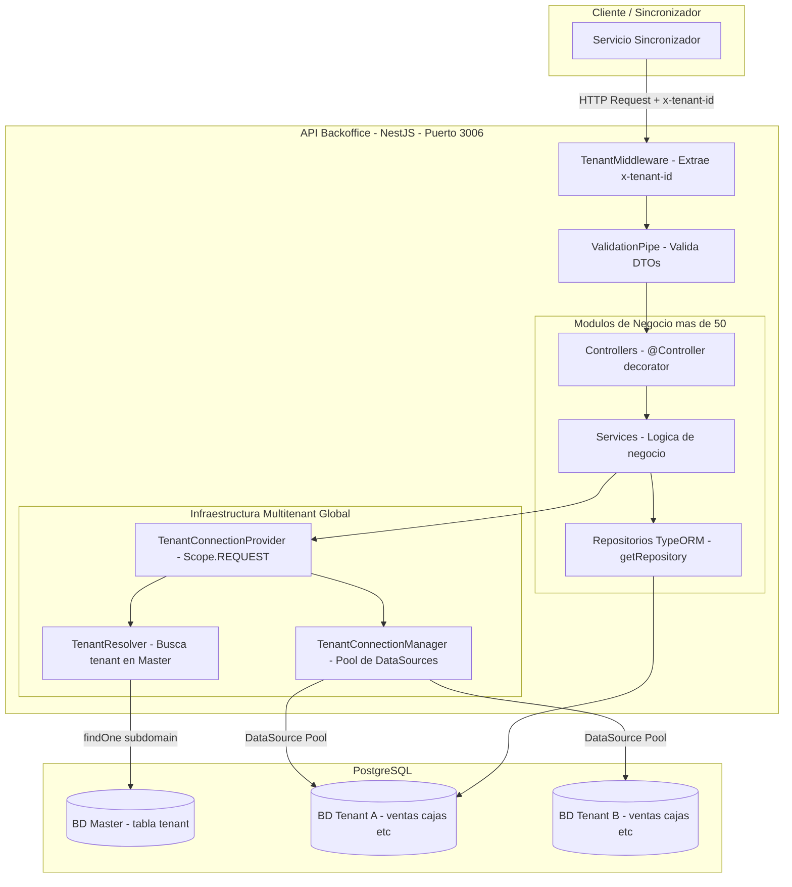
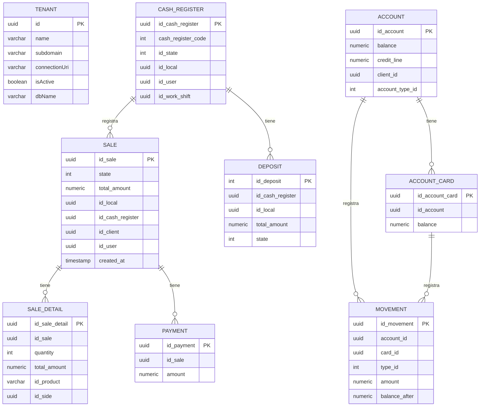
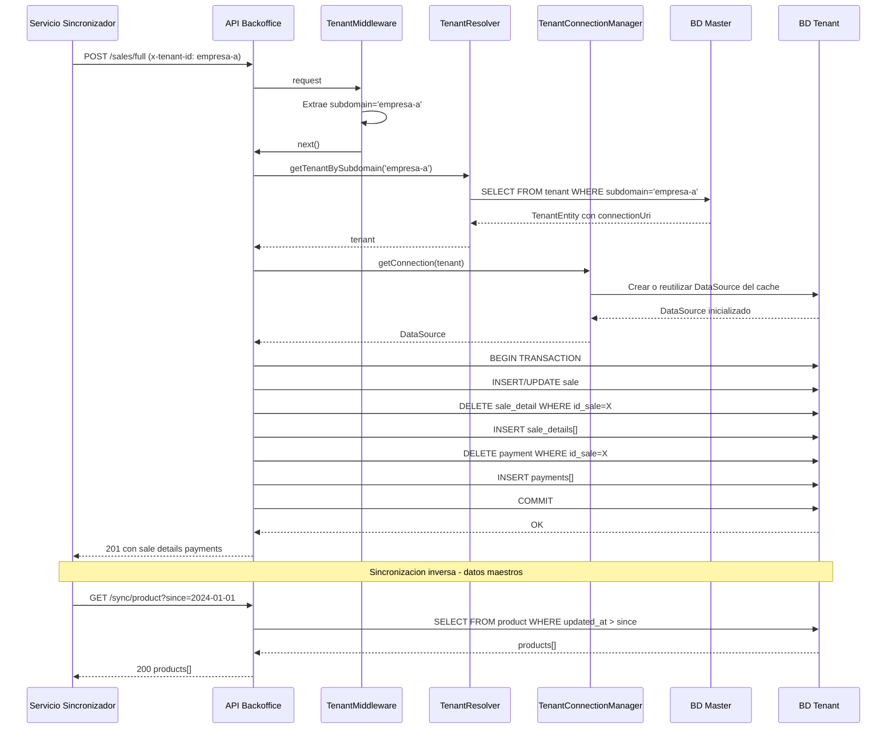
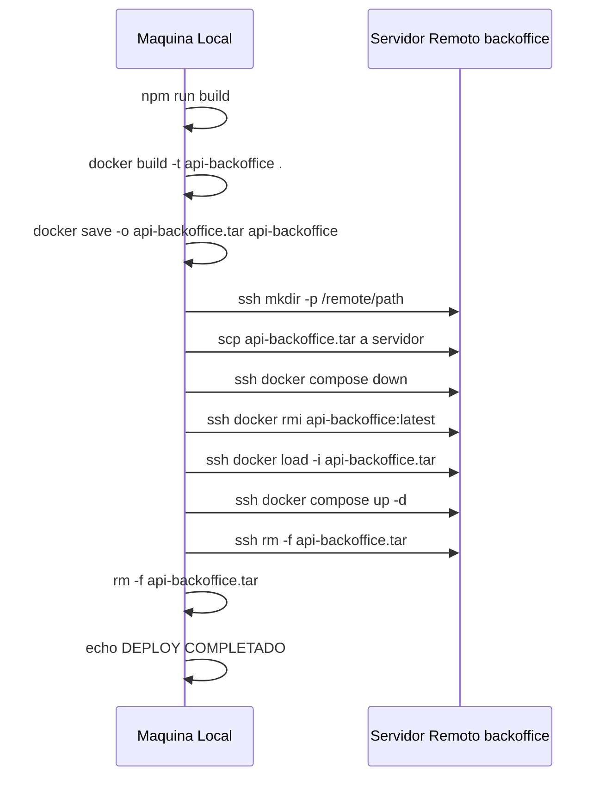

# API Backoffice

> API REST multitenant construida con **NestJS** y **TypeORM** que actúa como backend centralizado para la gestión de datos del sistema de punto de venta. Recibe datos sincronizados desde el **Servicio Sincronizador** y los persiste en bases de datos **PostgreSQL** separadas por tenant.

---

## 1. Descripción

### Objetivo de la API

`api-backoffice` es el **backend centralizado** del ecosistema de punto de venta. Actúa como fuente de verdad para todos los datos maestros (productos, clientes, cajas, series, roles, usuarios, etc.) y como receptor de los datos transaccionales (ventas, depósitos, movimientos de cuenta) generados en los puntos de venta.

### Problema que resuelve

En un entorno de punto de venta distribuido, cada local genera transacciones de forma independiente (ventas, movimientos de caja, depósitos). El **Servicio Sincronizador** actúa como intermediario y envía estos datos a la API Backoffice, que los valida, transforma y persiste en la base de datos correcta del tenant correspondiente. De esta forma se logra:

- **Centralización** de datos transaccionales desde múltiples puntos de venta.
- **Distribución** de datos maestros hacia los puntos de venta.
- **Aislamiento por tenant** (multi-tenancy): cada empresa tiene su propia base de datos.
- **Idempotencia** en sincronizaciones: los registros pueden sincronizarse múltiples veces sin duplicados.

### Arquitectura General

La API implementa una arquitectura **multitenant con base de datos por tenant**. Existe una **base de datos master** que registra los tenants (empresas) y sus credenciales de conexión. En tiempo de ejecución, cada request es asociado a un tenant mediante el header `x-tenant-id` o el subdominio del host, y la API abre o reutiliza una conexión al database del tenant correspondiente.

```
[Servicio Sincronizador]
        │
        │ HTTP (x-tenant-id)
        ▼
[API Backoffice - NestJS]
        │
        ├─── [BD Master (PostgreSQL)] ── Tabla: tenant (metadatos de tenants)
        │
        └─── [BD Tenant A (PostgreSQL)] ── Tablas de negocio (ventas, cajas, etc.)
        └─── [BD Tenant B (PostgreSQL)] ── Tablas de negocio (ventas, cajas, etc.)
        └─── [BD Tenant N (PostgreSQL)] ── ...
```

### Tecnologías Utilizadas

- **NestJS v11** — Framework principal (arquitectura modular, DI, pipes, middleware)
- **TypeORM v0.3** — ORM para PostgreSQL, conexiones dinámicas por tenant
- **PostgreSQL** — Motor de base de datos (master y por tenant)
- **Node.js v20** — Entorno de ejecución
- **TypeScript v5.7** — Lenguaje de programación
- **Docker** — Contenedorización para producción
- **class-validator / class-transformer** — Validación de DTOs

### Principales Módulos

El proyecto cuenta con más de **50 módulos** organizados en dos categorías:

| Categoría | Módulos |
|---|---|
| **Infraestructura** | `TenantModule` (conexiones multitenant) |
| **Datos Maestros** | `ProductModule`, `ClientModule`, `UserModule`, `RoleModule`, `LocalModule`, `TankModule`, `HoseModule`, `VehicleModule`, `DriverModule`, `SideModule`, `SerieModule`, `GroupSerieModule`, `WorkShiftModule`, `SectionModule`, `PaymentMethodModule`, `CurrencyModule`, `BankModule`, `BankAccountModule`, `DiscountModule`, `AuthorizationCodeModule`, `ReceiptConfigurationModule`, `ReportModule`, `EmployeeModule`, `AccountModule`, `AccountCardModule`, `AccountTypeModule`, `AccountCardTypeModule`, `AccountProductModule`, `AccountCardProductModule`, `MovementTypeModule`, `LocalPointsModule`, `LocalPointsConfigModule`, `LocalPointsRulesModule`, `GeneralTypeModule`, `DepositTypeModule`, `RoleAccessModule`, `ModuleModule` |
| **Datos Transaccionales** | `SalesModule`, `CashRegisterModule`, `DepositModule`, `PaymentsModule`, `MovementModule`, `TransactionControllerModule`, `FlowMeterModule`, `LocalPointsMovementModule` |

### Cómo interactúa con el Servicio Sincronizador

El Servicio Sincronizador se comunica con la API Backoffice en dos direcciones:

1. **Sincronización de datos maestros (Backoffice → Ventas):** El sincronizador consulta los endpoints `GET /sync/*` para obtener actualizaciones de productos, clientes, usuarios, roles, series, etc., y los descarga hacia los puntos de venta.
2. **Envío de datos transaccionales (Ventas → Backoffice):** El sincronizador envía ventas, cajas, depósitos y movimientos a los endpoints `POST` correspondientes, que los validan y persisten en el tenant correcto.

### Cómo interactúa con PostgreSQL

- **Base de datos Master:** Contiene la tabla `tenant` con la información de conexión (`connectionUri`) de cada empresa. Se conecta al inicio usando credenciales del archivo `.env`.
- **Bases de datos por Tenant:** En cada request, el `TenantMiddleware` determina el tenant (por header `x-tenant-id` o subdominio), el `TenantResolver` lo busca en la base master, y el `TenantConnectionManager` abre o reutiliza una `DataSource` de TypeORM hacia la base de datos del tenant. Las conexiones se cachean en memoria (pool de hasta 10 conexiones por tenant).

---

## 2. Arquitectura

### Patrón arquitectónico

La API implementa una **arquitectura modular NestJS** con separación clara en capas. Cada dominio de negocio es un módulo independiente con su propio Controller, Service, entidades y DTOs.

### Componentes Arquitectónicos

| Componente | Propósito |
|---|---|
| **NestJS** | Framework que provee el sistema de inyección de dependencias, decoradores, pipes y el ciclo de vida de la aplicación. |
| **Arquitectura Modular** | Cada dominio (ventas, cajas, productos, etc.) es un módulo `@Module()` con responsabilidad única. El `AppModule` orquesta todos los módulos. |
| **Controllers** | Definen los endpoints HTTP. Reciben los requests, validan el body (vía DTOs) y delegan la lógica al Service. |
| **Services** | Contienen la lógica de negocio. Acceden a la base de datos vía `TenantConnectionProvider` para obtener el `DataSource` correcto del tenant activo. |
| **DTOs** | Objetos de Transferencia de Datos decorados con `class-validator`. Definen la estructura esperada del body de cada request. `ValidationPipe` los valida automáticamente. |
| **Entities** | Clases decoradas con `@Entity()` de TypeORM que mapean las tablas de la base de datos de cada tenant. |
| **TypeORM** | ORM que gestiona la conexión a PostgreSQL. Se usa con `DataSource` dinámica por tenant (sin `TypeOrmModule.forFeature` global para tablas de tenant). |
| **Dependency Injection (DI)** | NestJS inyecta servicios en controllers y otros servicios automáticamente. El `TenantConnectionProvider` usa `Scope.REQUEST` para ser instanciado por cada request. |
| **ConfigModule** | Carga variables de entorno desde `.env.development` y las expone globalmente mediante `ConfigService`. |
| **ValidationPipe** | Habilitado globalmente en `main.ts`. Valida automáticamente todos los DTOs de entrada. |
| **TenantMiddleware** | Middleware aplicado a todas las rutas (`*`). Extrae el `x-tenant-id` del header o el subdominio y lo inyecta en el request. |
| **TenantModule (`@Global()`)** | Módulo global que exporta `TenantResolver`, `TenantConnectionManager` y `TenantConnectionProvider`, disponibles en todos los módulos sin importarlos individualmente. |
| **Swagger** | **No detectado** en el código fuente (`@nestjs/swagger` no está en `package.json` ni en `main.ts`). |

### Diagrama de Arquitectura



---

## 3. Stack Tecnológico

| Tecnología | Versión | Uso dentro del proyecto |
|---|---|---|
| **Node.js** | 20 (Alpine) | Entorno de ejecución en producción (imagen Docker `node:20-alpine`) |
| **NestJS** | ^11.0.1 | Framework principal: módulos, controllers, services, pipes, middleware, DI |
| **TypeScript** | ^5.7.3 | Lenguaje de programación en todo el proyecto |
| **PostgreSQL** | — | Motor de base de datos (master y por tenant). Versión no especificada en el proyecto. |
| **TypeORM** | ^0.3.25 | ORM: entidades, repositorios, DataSource dinámica por tenant, migraciones |
| **@nestjs/typeorm** | ^11.0.0 | Integración de TypeORM con NestJS (`TypeOrmModule.forRootAsync`) |
| **@nestjs/config** | ^4.0.2 | Carga de variables de entorno con `ConfigModule` y `ConfigService` |
| **@nestjs/platform-express** | ^11.0.1 | Adaptador HTTP (Express bajo NestJS) |
| **pg** | ^8.16.2 | Driver de PostgreSQL para Node.js (usado internamente por TypeORM) |
| **class-validator** | ^0.14.2 | Validación declarativa de DTOs con decoradores (`@IsUUID`, `@IsNumber`, etc.) |
| **class-transformer** | ^0.5.1 | Transformación de objetos planos a instancias de clases DTO |
| **reflect-metadata** | ^0.2.2 | Soporte de metadatos para decoradores TypeScript (requerido por TypeORM y NestJS) |
| **rxjs** | ^7.8.1 | Programación reactiva, requerida por NestJS internamente |
| **Docker** | — | Contenedorización para despliegue en producción |
| **Docker Compose** | — | Orquestación del contenedor en el servidor (`docker compose up -d`) |
| **@nestjs/mapped-types** | * | Utilidades para crear DTOs derivados (PartialType, PickType, etc.) |
| **@swc/core** | ^1.10.7 | Compilador alternativo rápido para builds de desarrollo |
| **Jest** | ^29.7.0 | Framework de testing (unit tests y e2e) |
| **ESLint** | ^9.18.0 | Linter de código TypeScript |
| **Prettier** | ^3.4.2 | Formateador de código |
| **ts-node** | ^10.9.2 | Ejecución de TypeScript en Node.js (para migraciones TypeORM CLI) |
| **tsconfig-paths** | ^4.2.0 | Resolución de path aliases en TypeScript |

---

## 4. Requisitos Previos

| Herramienta | Versión Recomendada | Notas |
|---|---|---|
| **Git** | >= 2.30 | Para clonar el repositorio |
| **Node.js** | **20.x LTS** | La imagen Docker usa `node:20-alpine` |
| **npm** | >= 10.x | Incluido con Node.js 20 |
| **Docker** | >= 24.x | Para construir y ejecutar el contenedor |
| **Docker Compose** | >= 2.x (v2) | Para orquestar el servicio en producción. Usa `docker compose` (sin guión) |
| **PostgreSQL** | >= 14 | Dos instancias/bases de datos: `master` y una por tenant |
| **SSH Client** | Cualquier versión | Requerido para el script `deploy.sh` (conexión al servidor remoto) |
| **SCP** | — | Requerido por `deploy.sh` para transferir la imagen Docker |

### Variables de Entorno

Se requiere un archivo `.env.development` en la raíz del proyecto (ver [Sección 6](#6-variables-de-entorno)).

---

## 5. Instalación

### 1. Clonar el repositorio

```bash
git clone <url-del-repositorio>
cd api-backoffice
```

### 2. Instalar dependencias

```bash
npm install
```

### 3. Configurar variables de entorno

```bash
# Editar el archivo con los valores reales de tu entorno
nano .env.development
```

Ver la [Sección 6](#6-variables-de-entorno) para el detalle de cada variable.

### 4. Compilar el proyecto

```bash
npm run build
```

El código compilado queda en la carpeta `dist/`.

### 5. Ejecutar en Desarrollo

El modo desarrollo usa recarga automática (`--watch`):

```bash
npm run start:dev
```

La API quedará disponible en `http://localhost:3006` (o el puerto definido en `PORT`).

### 6. Ejecutar en Producción (con Docker)

```bash
# Compilar primero
npm run build

# Construir imagen Docker
docker build -t api-backoffice .

# Ejecutar con Docker Compose
docker compose up -d
```

O directamente con Docker:

```bash
docker run -d \
  -p 3006:3006 \
  --env-file .env.development \
  --name api-backoffice \
  api-backoffice
```

---

## 6. Variables de Entorno

El archivo `.env.development` define las variables de configuración. A continuación se documenta cada una basándose en el análisis del código fuente:

| Variable | Descripción | Ejemplo | Obligatoria |
|---|---|---|---|
| `DATABASE_HOST` | Host de la BD del tenant por defecto (usado en desarrollo) | `192.168.1.100` | Sí |
| `DATABASE_PORT` | Puerto PostgreSQL del tenant | `5432` | Sí |
| `DATABASE_NAME` | Nombre de la BD del tenant de desarrollo | `development` | Sí |
| `DATABASE_USER` | Usuario de PostgreSQL del tenant | `postgres` | Sí |
| `DATABASE_PASSWORD` | Contraseña del usuario del tenant | `••••••••` | Sí |
| `MASTER_DB_HOST` | Host de la BD master (almacena metadatos de tenants) | `192.168.1.100` | Sí |
| `MASTER_DB_PORT` | Puerto PostgreSQL del master | `5432` | Sí |
| `MASTER_DB_NAME` | Nombre de la BD master | `master` | Sí |
| `MASTER_DB_USER` | Usuario de PostgreSQL del master | `postgres` | Sí |
| `MASTER_DB_PASSWORD` | Contraseña del usuario del master | `••••••••` | Sí |
| `DEV_TENANT_SUBDOMAIN` | Subdominio del tenant usado en desarrollo cuando no se provee `x-tenant-id` | `dev` | Sí (dev) |
| `ENCRYPTION_KEY` | Clave de encriptación de 32 bytes en hex. Generar con: `openssl rand -hex 32` | `0123...abcdef` | Sí |
| `NODE_ENV` | Entorno de ejecución | `development` / `production` | Sí |
| `PORT` | Puerto en el que escucha la API | `3006` | No (default: `3017`) |

> **IMPORTANTE:** Las variables `MASTER_DB_*` son críticas para el funcionamiento del sistema multitenant. Sin ellas, la API no puede resolver ni conectarse a ningún tenant.

> **NOTA:** En producción, las variables de entorno se pasan directamente al contenedor Docker (mediante `.env` o variables en `docker-compose.yml`). No deben estar en el repositorio de Git.

---

## 7. Scripts

Todos los scripts están definidos en `package.json`.

### Scripts de Aplicación

| Comando | Descripción |
|---|---|
| `npm run build` | Compila el proyecto TypeScript a JavaScript en la carpeta `dist/` usando el NestJS CLI. Requerido antes de construir la imagen Docker. |
| `npm run start` | Inicia la aplicación en modo producción usando el NestJS CLI (requiere `dist/` compilado). |
| `npm run start:dev` | Inicia en modo desarrollo con hot-reload (`--watch`). La API se reinicia automáticamente al detectar cambios. |
| `npm run start:debug` | Inicia en modo debug con hot-reload y puerto de inspección abierto para conectar un debugger (ej. VSCode). |
| `npm run start:prod` | Ejecuta directamente `node dist/main.js`. Es el comando usado dentro del contenedor Docker. |

### Scripts de Calidad de Código

| Comando | Descripción |
|---|---|
| `npm run format` | Formatea todos los archivos `.ts` en `src/` y `test/` usando Prettier. |
| `npm run lint` | Ejecuta ESLint con corrección automática (`--fix`) sobre todo el código TypeScript. |

### Scripts de Testing

| Comando | Descripción |
|---|---|
| `npm run test` | Ejecuta todos los tests unitarios con Jest. |
| `npm run test:watch` | Ejecuta tests en modo watch (se re-ejecutan al cambiar archivos). |
| `npm run test:cov` | Ejecuta tests y genera un reporte de cobertura de código en `coverage/`. |
| `npm run test:debug` | Ejecuta tests en modo debug con inspector de Node.js. |
| `npm run test:e2e` | Ejecuta tests end-to-end usando la configuración `test/jest-e2e.json`. |

### Scripts de Migraciones (TypeORM)

| Comando | Descripción |
|---|---|
| `npm run migration:generate:master` | Genera una nueva migración para la BD **master** basándose en los cambios en entidades. |
| `npm run migration:run:master` | Ejecuta las migraciones pendientes en la BD **master**. |
| `npm run migration:revert:master` | Revierte la última migración en la BD **master**. |
| `npm run migration:generate:tenant` | Genera una nueva migración para las BDs **tenant**. |
| `npm run migration:run:tenant` | Ejecuta las migraciones pendientes en la BD del **tenant** configurado con variables `TYPEORM_*`. |
| `npm run migration:revert:tenant` | Revierte la última migración en la BD del **tenant** activo. |
| `npm run migrate:all` | Ejecuta `scripts/migrate-all-tenants.sh`. Itera sobre todos los tenants activos en master y aplica migraciones a cada uno. |
| `npm run tenant:setup` | Ejecuta `scripts/setup-new-tenant.sh`. Registra un nuevo tenant en master y aplica migraciones. Uso: `npm run tenant:setup -- <subdomain> <db_name> <db_user> <db_password>` |

---

## 8. Docker

### Dockerfile

El `Dockerfile` es un contenedor de **producción** de una sola etapa:

```dockerfile
FROM node:20-alpine         # Imagen base ligera con Node.js 20

WORKDIR /app                # Directorio de trabajo

COPY package*.json ./       # Copia manifiestos de dependencias
RUN npm install --omit=dev  # Instala SOLO dependencias de producción

COPY dist ./dist            # Copia el build compilado de NestJS

EXPOSE 3006                 # Declara el puerto expuesto

CMD ["node", "dist/main.js"] # Comando de inicio
```

> **IMPORTANTE:** El `Dockerfile` copia la carpeta `dist/` ya compilada. **Siempre ejecutar `npm run build` antes de `docker build`**.

### Build de la imagen

```bash
npm run build
docker build -t api-backoffice .
```

### Ejecutar el contenedor

```bash
docker run -d \
  -p 3006:3006 \
  -e MASTER_DB_HOST=<host> \
  -e MASTER_DB_PORT=5432 \
  -e MASTER_DB_NAME=master \
  -e MASTER_DB_USER=postgres \
  -e MASTER_DB_PASSWORD=<password> \
  -e NODE_ENV=production \
  -e PORT=3006 \
  --name api-backoffice \
  api-backoffice
```

### Docker Compose (Producción)

El proyecto utiliza `docker compose` en el servidor de producción. El archivo `docker-compose.yml` no está incluido en este repositorio (reside en el servidor en `/home/backoffice/infra/api-backoffice/`). El script `deploy.sh` lo invoca remotamente.

---

## 9. Estructura del Proyecto

```
api-backoffice/
├── src/
│   ├── main.ts                     # Punto de entrada: bootstrap, ValidationPipe, puerto
│   ├── app.module.ts               # Módulo raíz: importa todos los módulos, TenantMiddleware
│   ├── app.controller.ts           # Controller raíz
│   ├── app.service.ts              # Service raíz
│   │
│   ├── config/                     # Configuración de bases de datos
│   │   ├── database.config.ts      # Config TypeORM para BD master (getMasterDbConfig)
│   │   ├── master.datasource.ts    # DataSource para TypeORM CLI (migraciones master)
│   │   └── tenant.datasource.ts    # DataSource para TypeORM CLI (migraciones tenant)
│   │
│   ├── tenant/                     # Módulo @Global() para infraestructura multitenant
│   │   ├── tenant.module.ts        # Registra TypeORM master, exporta providers globalmente
│   │   ├── tenant.middleware.ts    # Extrae x-tenant-id del header o subdominio
│   │   ├── tenant.resolver.ts      # Busca tenant por subdominio en la BD master
│   │   ├── tenant-connection.manager.ts  # Pool de DataSources por tenant (cache en Map)
│   │   ├── entities/
│   │   │   └── tenant.entity.ts    # Mapea tabla 'tenant' de la BD master
│   │   ├── providers/
│   │   │   └── tenant-connection.provider.ts  # Provider REQUEST-scoped: DataSource del tenant activo
│   │   └── services/
│   │       └── tenant-db-initializer.service.ts  # OnModuleInit: crea función SQL en todos los tenants
│   │
│   ├── shared/                     # Utilidades compartidas entre módulos
│   │   ├── uuid-mapper.service.ts  # Mapea IDs enteros (ventas) a UUIDs (backoffice)
│   │   ├── uuid-mapper.module.ts   # Módulo que expone UuidMapperService
│   │   └── migration.service.ts    # Servicio auxiliar para migraciones
│   │
│   ├── migrations/                 # Migraciones TypeORM
│   │   └── master/                 # Migraciones para la BD master
│   │
│   ├── sales/                      # Módulo de ventas (transaccional)
│   ├── sale-details/               # Módulo de detalles de venta
│   ├── payments/                   # Módulo de pagos
│   ├── cash-register/              # Módulo de cajas registradoras
│   ├── deposit/                    # Módulo de depósitos
│   ├── movement/                   # Módulo de movimientos de cuenta
│   ├── transaction-controller/     # Módulo de transacciones de surtidores
│   ├── flow-meter/                 # Módulo de medidores de flujo
│   ├── product/                    # Módulo de productos (maestros)
│   ├── product-local/              # Módulo de productos por local
│   ├── client/                     # Módulo de clientes
│   ├── user/                       # Módulo de usuarios
│   ├── employee/                   # Módulo de empleados
│   ├── role/                       # Módulo de roles
│   ├── role-access/                # Módulo de accesos por rol
│   ├── module/                     # Módulo de módulos del sistema
│   ├── local/                      # Módulo de locales/sucursales
│   ├── side/                       # Módulo de lados de surtidor
│   ├── tank/                       # Módulo de tanques
│   ├── hose/                       # Módulo de mangueras/surtidores
│   ├── vehicle/                    # Módulo de vehículos
│   ├── driver/                     # Módulo de conductores
│   ├── account/                    # Módulo de cuentas corrientes
│   ├── account-card/               # Módulo de tarjetas de cuenta
│   ├── account-type/               # Módulo de tipos de cuenta
│   ├── account-card-type/          # Módulo de tipos de tarjeta de cuenta
│   ├── account-product/            # Módulo de productos por cuenta
│   ├── account-card-product/       # Módulo de productos por tarjeta de cuenta
│   ├── serie/                      # Módulo de series de comprobantes
│   ├── group-serie/                # Módulo de grupos de series
│   ├── receipt-configuration/      # Módulo de configuración de comprobantes
│   ├── section/                    # Módulo de secciones
│   ├── report/                     # Módulo de reportes
│   ├── report-section/             # Módulo de secciones de reportes
│   ├── payment-method/             # Módulo de métodos de pago
│   ├── payment-method-type/        # Módulo de tipos de método de pago
│   ├── work-shift/                 # Módulo de turnos de trabajo
│   ├── bank/                       # Módulo de bancos
│   ├── bank-account/               # Módulo de cuentas bancarias
│   ├── currency/                   # Módulo de monedas
│   ├── authorization-code/         # Módulo de códigos de autorización
│   ├── discount/                   # Módulo de descuentos
│   ├── general-type/               # Módulo de tipos generales
│   ├── movement-type/              # Módulo de tipos de movimiento
│   ├── local_points/               # Módulo de puntos por local
│   ├── local_points_config/        # Módulo de configuración de puntos
│   ├── local_points_rules/         # Módulo de reglas de puntos
│   ├── local_points_movement/      # Módulo de movimientos de puntos
│   ├── address/                    # Módulo de direcciones
│   ├── person/                     # Módulo de personas
│   └── person-address/             # Módulo de direcciones de personas
│
├── scripts/
│   ├── migrate-all-tenants.sh      # Aplica migraciones a todos los tenants activos
│   ├── setup-new-tenant.sh         # Registra un nuevo tenant y aplica migraciones
│   ├── deploy.sh                   # Script de deploy alternativo
│   ├── clean-modules.py            # Limpia módulos TypeORM duplicados
│   └── clean-typeorm-modules.sh    # Limpia definiciones TypeORM antiguas
│
├── test/                           # Tests end-to-end
├── Dockerfile                      # Imagen Docker de producción
├── deploy.sh                       # Script principal de despliegue (raíz del proyecto)
├── nest-cli.json                   # Configuración del NestJS CLI
├── tsconfig.json                   # Configuración TypeScript
├── tsconfig.build.json             # Configuración TypeScript para build (excluye tests)
├── eslint.config.mjs               # Configuración ESLint
├── .prettierrc                     # Configuración Prettier
├── .env.development                # Variables de entorno de desarrollo
├── .env.test                       # Variables de entorno de testing
└── package.json                    # Dependencias y scripts npm
```

---

## 10. Módulos

### Módulo de Infraestructura

| Módulo | Descripción | Responsabilidad |
|---|---|---|
| **TenantModule** | Módulo `@Global()` que gestiona toda la infraestructura multitenant. | Conecta a la BD master, resuelve tenants por subdominio, gestiona el pool de conexiones por tenant, inicializa funciones SQL en cada tenant al arranque. Exporta `TenantResolver`, `TenantConnectionManager` y `TenantConnectionProvider`. |

### Módulos de Datos Transaccionales (entrada desde Ventas)

| Módulo | Descripción | Endpoints |
|---|---|---|
| **SalesModule** | Registro de ventas con detalles y pagos. Soporte para upsert idempotente. | `POST /sales`, `POST /sales/full`, `GET /sales` |
| **CashRegisterModule** | Gestión de cajas registradoras. Protege estados LIQUIDADO/PRELIQUIDADO. | `POST /cash-registers`, `PATCH /cash-registers/by-code/:code/:local`, `POST /cash-registers/sides` |
| **DepositModule** | Registro de depósitos de caja. Resuelve UUID de la caja por código numérico. | `POST /deposits` |
| **PaymentsModule** | Registro de pagos individuales. | `POST /payments`, `GET /payments` |
| **MovementModule** | Movimientos de cuentas corrientes. Llama a la función SQL `insert_movement_external`. | `POST /sync/movement` |
| **TransactionControllerModule** | Transacciones de surtidores de combustible. | `POST /transaction-controller` |
| **FlowMeterModule** | Registro de lecturas de medidores de flujo. | `POST /sync/flow-meter` |
| **LocalPointsMovementModule** | Movimientos del programa de puntos de fidelidad. | *(ver controller)* |

### Módulos de Datos Maestros (salida hacia Ventas)

| Módulo | Descripción | Endpoints |
|---|---|---|
| **ProductModule** | Catálogo de productos y precios por local. | `GET /sync/product`, `GET /sync/product/local`, `POST /sync/product/local` |
| **ClientModule** | Directorio de clientes. Búsqueda por código o documento. | `GET /sync/client`, `POST /sync/client`, `GET/PUT /sync/client/code/:code`, `GET/PUT /sync/client/document/:document` |
| **UserModule** | Usuarios del sistema por tenant y local. | `GET /sync/user` |
| **EmployeeModule** | Empleados por local. | `GET /sync/employee` |
| **RoleModule** | Roles de usuarios. | `GET /sync/role` |
| **LocalModule** | Locales/sucursales de la empresa. | `GET /sync/local` |
| **SideModule** | Lados de surtidor por local. | `GET /sync/side` |
| **TankModule** | Tanques de combustible por local. | `GET /sync/tank` |
| **HoseModule** | Mangueras/surtidores. | `GET /sync/hose` |
| **VehicleModule** | Vehículos registrados. | `GET /sync/vehicle`, `POST /sync/vehicle` |
| **DriverModule** | Conductores. Búsqueda y actualización por documento. | `GET /sync/driver`, `POST /sync/driver`, `GET/PUT /sync/driver/document/:document` |
| **SerieModule** | Series de comprobantes por local. Sincronización del correlativo. | `GET /sync/serie`, `POST /sync/serie/correlative` |
| **GroupSerieModule** | Grupos de series por local. | `GET /sync/group-serie` |
| **AccountModule** | Cuentas corrientes de clientes (multi-tenant con filtro por local). | `GET /sync/account` |
| **AccountCardModule** | Tarjetas de cuenta (multi-tenant con filtro por local). | `GET /sync/account-card` |
| **PaymentMethodModule** | Métodos de pago configurados. | `GET /sync/payment_method` |
| **WorkShiftModule** | Turnos de trabajo. | `GET /sync/work-shift` |
| **SectionModule** | Secciones del sistema. | `GET /sync/section` |
| **ReceiptConfigurationModule** | Configuración de comprobantes de pago. | `GET /sync/receipt-configuration` |
| **ReportModule** | Configuración de reportes. | `GET /sync/report` |
| **BankModule** | Bancos disponibles. | `GET /sync/bank` |
| **BankAccountModule** | Cuentas bancarias de la empresa. | `GET /sync/bank-account` |
| **CurrencyModule** | Monedas disponibles. | `GET /sync/currency` |
| **AuthorizationCodeModule** | Códigos de autorización. | `GET /sync/authorization-code` |
| **DiscountModule** | Descuentos configurados. | `GET /sync/discount` |
| **LocalPointsModule** | Programa de puntos de fidelidad por local. | `GET /sync/local-point`, `POST /sync/local-point` |

---

## 11. Endpoints

Todos los endpoints usan el prefijo base de la API (ej. `http://localhost:3006`). El tenant se identifica mediante el header `x-tenant-id: <subdomain>`.

### Ventas (`/sales`)

| Método | Ruta | Descripción | HTTP |
|---|---|---|---|
| `POST` | `/sales` | Crea una venta simple | 201 / 500 |
| `POST` | `/sales/full` | Crea una venta completa con detalles y pagos en transacción atómica. Elimina y re-inserta detalles/pagos para idempotencia. | 201 / 500 |
| `GET` | `/sales` | Lista todas las ventas del tenant | 200 |

**Body `POST /sales/full`:**
```json
{
  "sale": {
    "id_sale": "550e8400-e29b-41d4-a716-446655440000",
    "state": 1,
    "total_amount": 118.00,
    "subtotal": 100.00,
    "total_discount": 0,
    "document_number": "B001-0001",
    "id_local": "uuid",
    "id_payment_type": "uuid",
    "id_cash_register": "uuid",
    "id_client": "uuid",
    "id_user": "uuid",
    "created_at": "2024-01-15T10:00:00Z",
    "updated_at": "2024-01-15T10:00:00Z"
  },
  "sale_details": [
    {
      "quantity": 1,
      "total_amount": 118.00,
      "id_product": "PROD-001",
      "id_side": 5,
      "unit_price": 118.00
    }
  ],
  "payments": [
    {
      "amount": 118.00
    }
  ]
}
```

---

### Cajas Registradoras (`/cash-registers`)

| Método | Ruta | Descripción | HTTP |
|---|---|---|---|
| `POST` | `/cash-registers` | Crea o actualiza una caja. Respeta estados protegidos (LIQUIDADO=4, PRELIQUIDADO=5). | 201 |
| `PATCH` | `/cash-registers/by-code/:cash_register_code/:id_local` | Actualiza el estado de una caja por su código numérico y UUID de local. | 200 / 404 |
| `POST` | `/cash-registers/sides` | Crea o actualiza un lado de caja (`cash_register_side`). | 201 |

**Body `POST /cash-registers`:**
```json
{
  "id_cash_register": 1,
  "id_user": "uuid",
  "id_state": 1,
  "opennig_date": "2024-01-15T08:00:00Z",
  "id_local": "uuid",
  "id_work_shift": "uuid"
}
```

**Body `PATCH /cash-registers/by-code/1/uuid`:**
```json
{ "id_state": 2 }
```

---

### Depósitos (`/deposits`)

| Método | Ruta | Descripción | HTTP |
|---|---|---|---|
| `POST` | `/deposits` | Crea o actualiza un depósito. Resuelve el UUID de la caja por código numérico. | 201 / 404 |

---

### Pagos (`/payments`)

| Método | Ruta | Descripción | HTTP |
|---|---|---|---|
| `POST` | `/payments` | Registra un pago | 201 |
| `GET` | `/payments` | Lista todos los pagos | 200 |

---

### Movimientos de Cuenta (`/sync/movement`)

| Método | Ruta | Descripción | HTTP |
|---|---|---|---|
| `POST` | `/sync/movement` | Inserta un movimiento de cuenta. Llama a la función SQL `insert_movement_external` que actualiza el balance de la cuenta/tarjeta con idempotencia (ON CONFLICT DO NOTHING). | 201 |

**Body:**
```json
{
  "id_movement": "uuid",
  "account_id": "uuid",
  "card_id": "uuid",
  "type_id": 1,
  "status": "COMPLETED",
  "amount": 500.00,
  "balance_after": 1500.00,
  "issued_at": "2024-01-15T10:00:00Z",
  "created_by": "uuid"
}
```

---

### Transacción Surtidor (`/transaction-controller`)

| Método | Ruta | Descripción | HTTP |
|---|---|---|---|
| `POST` | `/transaction-controller` | Registra una transacción de surtidor de combustible | 201 |

---

### Medidor de Flujo (`/sync/flow-meter`)

| Método | Ruta | Descripción | HTTP |
|---|---|---|---|
| `POST` | `/sync/flow-meter` | Registra una lectura de medidor de flujo | 201 |

---

### Endpoints de Sincronización de Datos Maestros (`/sync/*`)

Todos soportan `?since=<ISO8601>` para sincronización incremental (salvo donde se indica).

| Método | Ruta | Descripción |
|---|---|---|
| `GET` | `/sync/product` | Lista productos. Soporta `?since=`. |
| `GET` | `/sync/product/local` | Lista `product_local` por `?local_id=` (requerido). Filtra estrictamente. |
| `POST` | `/sync/product/local` | Guarda o actualiza registros `product_local` desde un punto de venta. |
| `GET` | `/sync/client` | Lista clientes. Soporta `?since=`. |
| `POST` | `/sync/client` | Guarda o actualiza un cliente desde ventas. |
| `GET` | `/sync/client/code/:code` | Busca cliente por código numérico. |
| `PUT` | `/sync/client/code/:code` | Actualiza cliente por código numérico. |
| `GET` | `/sync/client/document/:document` | Busca cliente por número de documento. |
| `PUT` | `/sync/client/document/:document` | Actualiza cliente por número de documento. |
| `GET` | `/sync/user` | Lista usuarios. Soporta `?since=` y `?local_id=`. |
| `GET` | `/sync/employee` | Lista empleados. Soporta `?since=` y `?local_id=`. |
| `GET` | `/sync/role` | Lista roles. Soporta `?since=`. |
| `GET` | `/sync/local` | Lista locales. Soporta `?since=`. |
| `GET` | `/sync/side` | Lista lados de surtidor por `?local_id=` (requerido). |
| `GET` | `/sync/tank` | Lista tanques. Soporta `?since=` y `?local_id=`. |
| `GET` | `/sync/hose` | Lista mangueras. Soporta `?since=`. |
| `GET` | `/sync/vehicle` | Lista vehículos. Soporta `?since=`. |
| `POST` | `/sync/vehicle` | Guarda o actualiza un vehículo. |
| `GET` | `/sync/driver` | Lista conductores. Soporta `?since=`. |
| `POST` | `/sync/driver` | Guarda o actualiza un conductor. |
| `GET` | `/sync/driver/document/:document` | Busca conductor por documento. |
| `PUT` | `/sync/driver/document/:document` | Actualiza conductor por documento. |
| `GET` | `/sync/serie` | Lista series por `?local_id=` (requerido). |
| `POST` | `/sync/serie/correlative` | Actualiza el correlativo actual de una o múltiples series. |
| `GET` | `/sync/group-serie` | Lista grupos de series por `?local_id=` (requerido). |
| `GET` | `/sync/account` | Lista cuentas corrientes. Soporta `?since=` y `?local_id=`. |
| `GET` | `/sync/account-card` | Lista tarjetas de cuenta. Soporta `?since=` y `?local_id=`. |
| `GET` | `/sync/payment_method` | Lista métodos de pago. Soporta `?since=`. |
| `GET` | `/sync/work-shift` | Lista turnos de trabajo. Soporta `?since=`. |
| `GET` | `/sync/section` | Lista secciones. Soporta `?since=`. |
| `GET` | `/sync/receipt-configuration` | Lista configuraciones de comprobante. Soporta `?since=`. |
| `GET` | `/sync/report` | Lista reportes. Soporta `?since=`. |
| `GET` | `/sync/bank` | Lista bancos. Soporta `?since=`. |
| `GET` | `/sync/bank-account` | Lista cuentas bancarias. Soporta `?since=`. |
| `GET` | `/sync/currency` | Lista monedas disponibles. |
| `GET` | `/sync/authorization-code` | Lista códigos de autorización. Soporta `?since=`. |
| `GET` | `/sync/discount` | Lista descuentos. Soporta `?since=`. |
| `GET` | `/sync/local-point` | Lista puntos de fidelidad por local. Soporta `?since=`. |
| `POST` | `/sync/local-point` | Guarda o actualiza un registro de local-point. |

---

## 12. Base de Datos

### Conexión

El sistema utiliza **dos tipos de bases de datos PostgreSQL**:

1. **Base de datos Master:** Una única BD que almacena la tabla `tenant` con los metadatos de cada empresa (credenciales de conexión, subdominio, plan, etc.). La conexión se configura con `TypeOrmModule.forRootAsync` usando las variables `MASTER_DB_*`.

2. **Bases de datos por Tenant:** Una BD independiente por empresa. La URL de conexión (`connectionUri`) se almacena en la tabla `tenant` de la BD master. En runtime, el `TenantConnectionManager` parsea esta URI y crea una `DataSource` dinámica con TypeORM.

### Entidades Principales

| Entidad | Tabla | BD |
|---|---|---|
| `TenantEntity` | `tenant` | Master |
| `Sale` | `sale` | Tenant |
| `SaleDetail` | `sale_detail` | Tenant |
| `Payment` | `payment` | Tenant |
| `CashRegister` | `cash_register` | Tenant |
| `CashRegisterSide` | `cash_register_side` | Tenant |
| `Deposit` | `deposit` | Tenant |
| `Account` | `account` | Tenant |
| `AccountCard` | `account_card` | Tenant |
| `Movement` | `movement` | Tenant |
| `Product` | `product` | Tenant |
| `ProductLocal` | `product_local` | Tenant |
| `TransactionController` | `transaction_controller` | Tenant |
| `PaymentMethod` | `payment_type` | Tenant |
| *(50+ entidades adicionales)* | *(ver carpeta entities/ de cada módulo)* | Tenant |

> **NOTA:** El campo `synchronize: false` está establecido en todas las DataSources. TypeORM **nunca sincroniza automáticamente** el schema. Los cambios se gestionan exclusivamente mediante migraciones.

### Migraciones

- **Master:** Scripts en `src/migrations/master/`. La tabla `tenant` ya existe en producción.
- **Tenants:** Scripts en `src/migrations/tenant/`. Se aplican con `npm run migration:run:tenant` o `scripts/migrate-all-tenants.sh`.

### Diagrama de Base de Datos (simplificado)



---

## 13. Flujo de Sincronización

### Dirección 1: Ventas → Backoffice (datos transaccionales)

El Servicio Sincronizador envía datos desde el punto de venta hacia el Backoffice.

#### Ejemplo: Sincronización de una venta completa

1. **Sincronizador** realiza `POST /sales/full` con header `x-tenant-id: empresa-a`.
2. **TenantMiddleware** extrae `empresa-a` del header y lo asigna a `req.subdomain`.
3. **ValidationPipe** valida el body contra `CreateSaleWithDetailsDto`.
4. **SalesController** recibe el body validado y llama a `SalesService.createWithDetails()`.
5. **SalesService** obtiene el `DataSource` del tenant vía `TenantConnectionProvider`:
   - `TenantConnectionProvider.getDataSource()` llama a `TenantResolver.getTenantBySubdomain('empresa-a')`.
   - `TenantResolver` busca en la BD master la fila con `subdomain = 'empresa-a'`.
   - `TenantConnectionManager.getConnection(tenant)` abre (o reutiliza del cache) una `DataSource` hacia la BD del tenant.
6. **SalesService** inicia una transacción (`queryRunner`).
7. **UuidMapperService** traduce los IDs enteros del sistema de ventas a UUIDs del backoffice (`id_payment_type`, `id_cash_register`, `id_side`).
8. La venta es **upsertada** (save con PK existente = actualización).
9. Los detalles anteriores son **eliminados** y **reinsertados** (idempotencia).
10. Los pagos anteriores son **eliminados** y **reinsertados** (idempotencia).
11. La transacción es **confirmada** (`COMMIT`) o **revertida** (`ROLLBACK`) en caso de error.
12. Se retorna `{ sale, details, payments }` con HTTP 201.

### Dirección 2: Backoffice → Ventas (datos maestros)

El Servicio Sincronizador consulta los endpoints `GET /sync/*` para obtener datos actualizados.

- Todos los endpoints soportan `?since=<ISO8601>` para **sincronización incremental** (solo registros modificados desde esa fecha).
- El filtro se aplica sobre la columna `updated_at` de cada entidad.

### Diagrama de Secuencia



---

## 14. Seguridad

### Mecanismos de Seguridad Implementados

| Mecanismo | Estado | Descripción |
|---|---|---|
| **ValidationPipe** | Activo | Habilitado globalmente en `main.ts`. Valida todos los DTOs de entrada con `class-validator`. Rechaza requests con datos inválidos. |
| **TenantMiddleware** | Activo | Aplicado a todas las rutas (`forRoutes('*')`). Identifica el tenant en cada request. |
| **TenantResolver** | Activo | Lanza `UnauthorizedException` si el tenant no existe. Lanza `ForbiddenException` si el tenant está inactivo (`isActive = false`). |
| **Estado Protegido de Caja** | Activo | En `CashRegisterService`, los estados LIQUIDADO (4) y PRELIQUIDADO (5) no pueden ser sobreescritos por el sincronizador. |
| **CORS** | No configurado | No se encontró configuración de CORS en `main.ts` ni en ningún módulo. |
| **JWT / Guards de Autenticación** | No detectado | No se encontró implementación de JWT, `AuthGuard` o guards de autenticación en el código fuente. |
| **Interceptors** | No detectado | No se encontraron interceptors globales o de módulo. |
| **Rate Limiting** | No detectado | No se encontró configuración de limitación de tasa. |

> **ADVERTENCIA:** La API no implementa autenticación JWT ni CORS en el código analizado. Se asume que la seguridad perimetral (firewall, VPN, red privada) protege el acceso a la API, ya que está diseñada para ser consumida exclusivamente por el Servicio Sincronizador en una red interna.

---

## 15. Logs

### Ver logs del contenedor en tiempo real

```bash
# Logs en tiempo real
docker logs -f api-backoffice

# Últimas 100 líneas
docker logs --tail 100 api-backoffice

# Logs con timestamps
docker logs -t api-backoffice
```

### Ver logs con Docker Compose

```bash
# Desde el directorio con docker-compose.yml (servidor remoto)
docker compose logs -f api-backoffice

# Con timestamps y últimas 200 líneas
docker compose logs -t --tail 200 api-backoffice
```

### Acceder al contenedor en ejecución

```bash
# Abrir shell dentro del contenedor
docker exec -it api-backoffice sh

# Ejecutar comando específico
docker exec api-backoffice node -e "console.log('test')"
```

### Referencia de mensajes de log

| Mensaje de log | Significado |
|---|---|
| `Resolved tenant: empresa-a` | TenantMiddleware resolvió el subdomain correctamente |
| `Conexion creada para tenant: X (total activas: N)` | Nueva conexión a BD de tenant abierta |
| `[CashRegister] Sincronizacion ignorada — estado protegido` | Caja en estado LIQUIDADO/PRELIQUIDADO, sync ignorada |
| `Eliminando detalles anteriores de la venta...` | Re-sync de venta: eliminando registros anteriores |
| `Reinsertando detalles actualizados...` | Re-sync de venta: insertando nuevos registros |
| `Error al guardar venta:` | Error en la sincronización de ventas |
| `Function ready in tenant: X` | Función SQL inicializada correctamente al arranque |
| `Failed tenant: X` | Error al inicializar un tenant en el arranque |

---

## 16. Despliegue

El despliegue se realiza mediante el script `deploy.sh` ubicado en la raíz del proyecto.

### Configuración del script

```bash
IMAGE_NAME=api-backoffice                              # Nombre de la imagen Docker
SERVER=backoffice                                      # Alias SSH del servidor
REMOTE_PATH=/home/backoffice/infra/api-backoffice      # Ruta en el servidor remoto
```

> El alias `backoffice` debe estar configurado en `~/.ssh/config` con el host, usuario y clave SSH del servidor de producción.

### Paso a paso del deploy

#### 1. Compilar NestJS localmente

```bash
npm run build
# Genera dist/ con el JavaScript compilado
```

#### 2. Build de la imagen Docker

```bash
docker build -t api-backoffice .
# Usa el Dockerfile: copia dist/ e instala solo deps de producción
```

#### 3. Exportar la imagen como TAR

```bash
docker save -o api-backoffice.tar api-backoffice
# Empaqueta la imagen en un archivo portable
```

#### 4. Crear directorio en el servidor

```bash
ssh backoffice "mkdir -p /home/backoffice/infra/api-backoffice"
# Se usa SSH con ControlMaster para multiplexar la conexión
```

#### 5. Transferir la imagen al servidor

```bash
scp api-backoffice.tar backoffice:/home/backoffice/infra/api-backoffice/
```

#### 6. Ejecutar remotamente en el servidor

```bash
ssh backoffice << 'EOF'
  cd /home/backoffice/infra/api-backoffice
  docker compose down || true           # Detener contenedor anterior
  docker rmi api-backoffice:latest || true  # Eliminar imagen anterior
  docker load -i api-backoffice.tar     # Cargar nueva imagen
  docker compose up -d                  # Levantar servicio
  rm -f api-backoffice.tar              # Limpiar TAR del servidor
EOF
```

#### 7. Limpiar el TAR local

```bash
rm -f api-backoffice.tar
echo "DEPLOY COMPLETADO"
```

### Requisitos para el deploy

- Alias SSH `backoffice` configurado en `~/.ssh/config`.
- Docker y Docker Compose instalados en el servidor.
- `docker-compose.yml` presente en `/home/backoffice/infra/api-backoffice/` en el servidor.

### Diagrama del flujo de deploy



---

## 17. Solución de Problemas

### Puerto ya en uso

**Error:** `Error: listen EADDRINUSE: address already in use :::3006`

```bash
# Encontrar el proceso
lsof -i :3006
# Terminar el proceso
kill -9 <PID>
# O cambiar el puerto en .env.development
PORT=3007
```

---

### Variables de entorno faltantes

**Error:** La API arranca pero no puede resolver tenants.

```bash
# Verificar el archivo
cat .env.development

# Las variables MASTER_DB_* son obligatorias
# Sin ellas el TenantModule no puede conectarse al master
```

---

### No conecta a PostgreSQL

**Error:** `ECONNREFUSED` en los logs.

```bash
# Verificar disponibilidad de PostgreSQL
pg_isready -h <MASTER_DB_HOST> -p <MASTER_DB_PORT>

# Verificar conectividad
telnet <MASTER_DB_HOST> <MASTER_DB_PORT>

# Probar credenciales
psql -h <MASTER_DB_HOST> -p <MASTER_DB_PORT> -U <MASTER_DB_USER> -d <MASTER_DB_NAME>
```

---

### Docker daemon no está corriendo

**Error:** `Cannot connect to the Docker daemon`

```bash
sudo systemctl start docker
sudo systemctl status docker
```

---

### Error en build TypeScript

```bash
# Limpiar y recompilar
rm -rf dist/
npm run build

# Ver errores detallados
npm run build 2>&1 | head -50
```

---

### Dependencias faltantes o corruptas

**Error:** `Cannot find module` al iniciar.

```bash
rm -rf node_modules package-lock.json
npm install
```

---

### Error TypeORM: entity metadata not found

**Causa:** La entidad no está incluida en el glob `/**/*.entity{.ts,.js}` del `TenantConnectionManager`.

**Solución:** Verificar que el archivo sigue el patrón `*.entity.ts` y está dentro de `src/`.

---

### Error en sincronización: UUID no encontrado

**Error:** `No se encontró UUID en la tabla 'X' para migration_sync_id = N`

**Causa:** `UuidMapperService` no pudo mapear un ID entero del sistema de ventas al UUID del backoffice.

**Solución:**
1. Verificar que el dato maestro (local, caja, side, etc.) existe en la BD del tenant.
2. Verificar que el campo `migration_sync_id` o `cash_register_code` coincide.
3. Sincronizar primero los datos maestros antes que los transaccionales.

---

### Error en deploy: SSH connection refused

```bash
# Verificar configuración SSH
cat ~/.ssh/config

# Probar conexión
ssh -v backoffice echo "OK"
```

---

### El contenedor Docker se detiene inmediatamente

```bash
# Ver logs del contenedor detenido
docker logs api-backoffice

# Verificar variables de entorno
docker inspect api-backoffice | grep -A 20 '"Env"'
```

---

## 18. Buenas Prácticas

### Agregar un Nuevo Módulo

Seguir el patrón de módulos existentes (ej. `product`, `client`):

1. **Crear la estructura de carpetas:**
   ```
   src/mi-modulo/
   ├── dto/
   │   └── create-mi-modulo.dto.ts
   ├── entities/
   │   └── mi-modulo.entity.ts
   ├── mi-modulo.controller.ts
   ├── mi-modulo.service.ts
   └── mi-modulo.module.ts
   ```

2. **Registrar en `app.module.ts`:**
   ```typescript
   import { MiModuloModule } from './mi-modulo/mi-modulo.module';
   // Agregar en imports: [...]
   MiModuloModule,
   ```

---

### Agregar una Entidad

```typescript
// src/mi-modulo/entities/mi-modulo.entity.ts
import { Entity, PrimaryColumn, Column } from 'typeorm';

@Entity('nombre_tabla_en_bd')
export class MiModulo {
  @PrimaryColumn('uuid')
  id_mi_modulo: string;

  @Column({ type: 'varchar' })
  nombre: string;

  @Column({ type: 'timestamp' })
  created_at: Date;

  @Column({ type: 'timestamp' })
  updated_at: Date;

  @Column({ type: 'char', length: 1, nullable: true })
  state_audit: string;
}
```

> **IMPORTANTE:** Las entidades NO usan `TypeOrmModule.forFeature()`. Los repositorios se obtienen dinámicamente con `dataSource.getRepository(MiEntidad)` desde el Service.

---

### Crear un Controller

```typescript
import { Controller, Get, Post, Body, Query } from '@nestjs/common';
import { MiModuloService } from './mi-modulo.service';
import { CreateMiModuloDto } from './dto/create-mi-modulo.dto';

@Controller('sync')
export class MiModuloController {
  constructor(private readonly service: MiModuloService) {}

  @Get('mi-recurso')
  async getAll(@Query('since') since?: string) {
    return this.service.getForSync(since);
  }

  @Post('mi-recurso')
  async create(@Body() dto: CreateMiModuloDto) {
    return this.service.saveOrUpdate(dto);
  }
}
```

---

### Crear un Service

```typescript
import { Injectable } from '@nestjs/common';
import { TenantConnectionProvider } from '../tenant/providers/tenant-connection.provider';
import { MiModulo } from './entities/mi-modulo.entity';

@Injectable()
export class MiModuloService {
  constructor(private readonly tenantConnection: TenantConnectionProvider) {}

  async getForSync(since?: string) {
    const dataSource = await this.tenantConnection.getDataSource();
    const repo = dataSource.getRepository(MiModulo);

    const query = repo.createQueryBuilder('m');
    if (since) {
      query.where('m.updated_at > :since', { since });
    }
    return query.getMany();
  }
}
```

---

### Agregar DTOs con Validación

```typescript
import { IsString, IsUUID, IsOptional, IsDateString } from 'class-validator';

export class CreateMiModuloDto {
  @IsUUID()
  id_mi_modulo: string;

  @IsString()
  nombre: string;

  @IsOptional()
  @IsDateString()
  created_at?: string;
}
```

---

### Agregar Sincronizaciones (desde Ventas hacia Backoffice)

Para recibir datos del Sincronizador y persistirlos:

1. Crear el DTO con validaciones `class-validator`.
2. En el Service, obtener `dataSource` vía `TenantConnectionProvider`.
3. Implementar **upsert** (buscar si existe, actualizar; si no, crear).
4. Si el registro usa IDs enteros del sistema de ventas, usar `UuidMapperService` para resolverlos a UUIDs.
5. Para operaciones complejas (múltiples tablas), usar `queryRunner` con transacción explícita.

---

### Mantener la Arquitectura

- **Nunca usar `synchronize: true`** en TypeORM. Siempre usar migraciones explícitas.
- **Nunca exponer credenciales** en el código. Usar `ConfigService` o variables de entorno.
- **Siempre validar DTOs** con `class-validator`. El `ValidationPipe` global rechaza requests inválidos automáticamente.
- **Siempre verificar el tenant** antes de acceder a datos. El `TenantConnectionProvider` garantiza el aislamiento.
- Mantener el patrón `controller → service → repository (vía tenant connection)` sin saltarse capas.
- Nunca importar `TenantResolver`, `TenantConnectionManager` ni `TenantConnectionProvider` directamente en módulos hijos; ya están disponibles por el `@Global()` del `TenantModule`.

---

## 19. Conclusión

`api-backoffice` es el **núcleo del sistema de punto de venta**: una API REST multitenant construida sobre NestJS 11 y TypeORM que gestiona el aislamiento de datos entre empresas (tenants), la distribución de datos maestros y la recepción de datos transaccionales.

### Flujo completo resumido

```
[Punto de Venta] <---> [Servicio Sincronizador] <---> [API Backoffice] <---> [PostgreSQL por Tenant]
                                                              |
                                                              +---> [BD Master] (tabla tenant)
```

1. **El Servicio Sincronizador** actúa como puente entre cada punto de venta y la API Backoffice.
2. **En cada request**, el `TenantMiddleware` identifica la empresa por el header `x-tenant-id`, y el `TenantConnectionProvider` obtiene (o crea) la conexión a su base de datos exclusiva.
3. **Para datos maestros** (productos, clientes, roles, series, etc.), el Sincronizador consulta los endpoints `GET /sync/*` con el parámetro `?since=` para obtener solo los cambios recientes.
4. **Para datos transaccionales** (ventas, cajas, depósitos, movimientos), el Sincronizador envía a los endpoints `POST` correspondientes, que validan, transforman IDs (enteros a UUIDs) y persisten en transacciones atómicas con idempotencia garantizada.
5. **La función SQL `insert_movement_external`** se crea automáticamente en cada tenant al arrancar la aplicación (`OnModuleInit`), garantizando la integridad del balance de cuentas corrientes con soporte nativo de idempotencia (`ON CONFLICT DO NOTHING`).

La arquitectura garantiza **escalabilidad horizontal** (múltiples tenants en una sola instancia), **consistencia de datos** (transacciones ACID), **idempotencia** (re-sincronizaciones sin duplicados) y **trazabilidad** (logs detallados en cada operación crítica).
